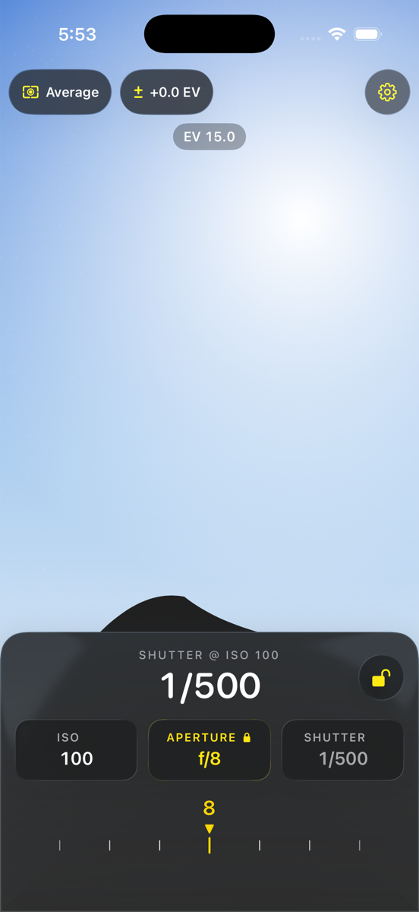
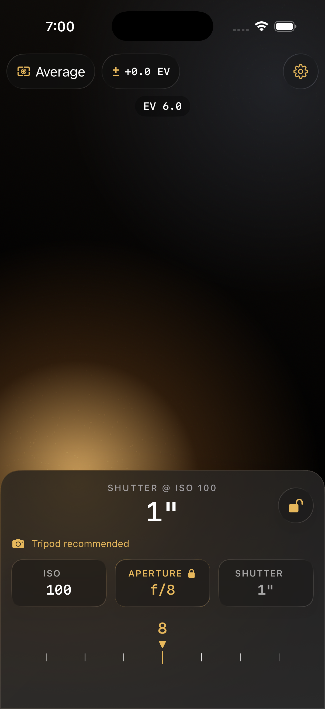
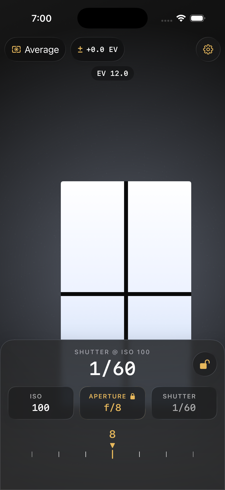

# Design harness: the meter screen in the Simulator

The Simulator has no capture device. `CameraLightSource` therefore never produces
a reading, `MeterViewModel` lands on `.unavailable`, and the meter screen never
renders — which historically meant every design iteration had to be built to a
phone.

The design harness removes that block. Launched with `-design-harness`, a debug
build drives the meter from a **scripted light source** at a scene EV you choose,
and draws a **stand-in scene** behind the UI in place of the camera preview.
Nothing downstream is special-cased: `MeterViewModel` and `ExposureEngine` run
exactly the code they run on a phone.

Further arguments name the *state* the screen is in — priority mode, metering
pattern, compensation, freeze, which advisory is showing, and the moment before
any reading has arrived — so a screenshot shows a state that was chosen rather
than one that was stumbled into. See [the named states](#the-named-states).

Everything under `Lightmeter/DesignHarness/` is wrapped in `#if DEBUG` at file
scope, so a Release build compiles none of it. The only production-code
concession is `ContentView`'s optional `source:` parameter, which is `nil` in
Release and leaves behaviour exactly as it was.

## Launch arguments

| Argument | Values | Default |
| --- | --- | --- |
| `-design-harness` | *(flag)* — nothing else has any effect without it | off |
| `-harness-scene` | `blown-sky`, `dim-interior`, `mixed-contrast` | `blown-sky` |
| `-harness-ev` | any number — the scene's EV@ISO 100 | the scene's own nominal EV |
| `-harness-priority` | `aperture`, `shutter` | `aperture` |
| `-harness-pattern` | `average`, `spot` | `average` |
| `-harness-compensation` | any number of stops, clamped to ±3 | `0` |
| `-harness-frozen` | *(flag)* — hold the first reading | live |
| `-harness-pending` | *(flag)* — never deliver a reading | off |
| `-harness-advisory` | `none`, `handheld`, `tripod`, `out-of-range` | whatever the scene produces |

A mistyped value falls back rather than failing to launch, so a typo still gives
a running screen to look at.

The state options are set through `MeterViewModel`'s own entry points, on a
running meter, immediately after it starts — the same calls a tap would make.
Nothing the harness reaches is a state the UI could not.

Two options interact with the others, and both are documented rather than
clever:

- **`-harness-advisory` outranks `-harness-ev` and `-harness-priority`.**
  Advisories are derived from the solve; there is no setter for them. A preset
  therefore pins the light *and* the legs whose honest solve raises the warning
  it names — it cannot promise the warning otherwise. `handheld` and `tripod`
  only exist where the shutter is solved, so they also force aperture-priority;
  `none` and `out-of-range` keep the mode you asked for. The backdrop is *not*
  pinned, so pair a preset with `-harness-scene` if you want the scene to look
  like the light being read. Presets assume no compensation — pass
  `-harness-compensation` alongside one and you get whatever that solves to.
- **`-harness-pending` outranks `-harness-frozen`.** There is no reading to
  hold, so the freeze is dropped rather than left waiting for one.

## The reference shots

Today's meter screen under the harness, at the commit that introduced it —
the baseline any variant is compared against. Regenerate them with the
sequence below whenever the meter screen changes deliberately.

| `blown-sky` | `dim-interior` | `mixed-contrast` |
| --- | --- | --- |
|  |  |  |

### The scenes

| Scene | Nominal EV | What it is for |
| --- | --- | --- |
| `blown-sky` | 15 | Sunny-16 daylight. Most of the HUD sits over the brightest part of the frame; a near-black treeline cuts across the drawer. |
| `dim-interior` | 6 | A lamp-lit room. Almost all shadow — where a dark scrim risks vanishing into the scene behind it. Also the state that raises the tripod advisory. |
| `mixed-contrast` | 12 | A dark room with a blown window, placed so the drawer's surface carries near-white and near-black at once. |

The scenes are **drawn**, not photographed: a drawn scene renders identically on
every run (which is what makes two screenshots comparable), reviews in a diff,
and carries no licensing. What glass needs from a backdrop is luminance
structure — a hard edge, a hot spot, a deep shadow — and that is what they carry.

## Taking a screenshot, end to end

From the repository root. Substitute any available simulator name.

```sh
DEVICE_NAME="iPhone 17 Pro"
BUNDLE_ID=dev.gortiz.Lightmeter
DERIVED=/tmp/lightmeter-harness

# 0. Resolve one UDID. Several runtimes can offer the same device name, and
#    every later step has to address the *same* simulator.
UDID=$(xcrun simctl list devices available --json \
  | python3 -c "import json,sys;print(next(d['udid'] for v in json.load(sys.stdin)['devices'].values() for d in v if d['name']=='$DEVICE_NAME'))")

# 1. Build the debug app for the Simulator.
xcodebuild \
  -project Lightmeter.xcodeproj \
  -scheme Lightmeter \
  -destination "platform=iOS Simulator,id=$UDID" \
  -derivedDataPath "$DERIVED" \
  build

# 2. Boot the simulator and wait for it.
xcrun simctl boot "$UDID" 2>/dev/null || true
xcrun simctl bootstatus "$UDID" -b

# 3. Install.
xcrun simctl install "$UDID" \
  "$DERIVED/Build/Products/Debug-iphonesimulator/Lightmeter.app"

# 4. Launch under the harness.
xcrun simctl terminate "$UDID" "$BUNDLE_ID" 2>/dev/null || true
xcrun simctl launch "$UDID" "$BUNDLE_ID" \
  -design-harness -harness-scene blown-sky

# 5. Screenshot, once the first reading has landed.
sleep 3
xcrun simctl io "$UDID" screenshot meter-blown-sky.png
```

Steps 4–5 are the loop you repeat per scene — the build and install only need
redoing when the code changes:

```sh
for scene in blown-sky dim-interior mixed-contrast; do
  xcrun simctl terminate "$UDID" "$BUNDLE_ID" 2>/dev/null || true
  xcrun simctl launch "$UDID" "$BUNDLE_ID" -design-harness -harness-scene "$scene"
  sleep 3
  xcrun simctl io "$UDID" screenshot "meter-$scene.png"
done
```

To pin a specific reading rather than the scene's own light:

```sh
xcrun simctl launch "$UDID" "$BUNDLE_ID" \
  -design-harness -harness-scene mixed-contrast -harness-ev 9.5
```

## The named states

Every state below is one launch — substitute it for step 4 above and screenshot
as usual. They are named so a review can ask for one by name.

| Name | What it shows | Launch arguments |
| --- | --- | --- |
| `default` | The ordinary screen: aperture-priority, average, live. The baseline. | *(none)* |
| `pending` | Metering, before the first reading: the hero and the solved chip on their em-dash placeholder, no EV. | `-harness-pending` |
| `frozen` | A held reading — the padlock closed. | `-harness-frozen` |
| `spot` | Spot metering with the reticle at the frame center, EV on the badge. | `-harness-pattern spot` |
| `shutter-priority` | The shutter locked and the aperture solved — the mirror of the default. | `-harness-priority shutter` |
| `compensated` | +1 EV of deliberate bias, on the pill and in the solve. | `-harness-compensation 1.0` |
| `no-advisories` | A comfortable solve, so the advisory row is deliberately empty. | `-harness-advisory none` |
| `handheld-risk` | The soft warning: a solve between 1/60 s and 1/15 s. | `-harness-advisory handheld -harness-scene mixed-contrast` |
| `tripod` | The strong warning: a one-second solve. | `-harness-advisory tripod -harness-scene dim-interior` |
| `out-of-range` | The solved leg off the end of its scale — the range warning. | `-harness-advisory out-of-range` |
| `worst-case` | Everything at once, over the hardest backdrop: shutter-priority, spot, +1 EV, frozen. | `-harness-scene mixed-contrast -harness-priority shutter -harness-pattern spot -harness-compensation 1.0 -harness-frozen` |

For example, the last one in full:

```sh
xcrun simctl terminate "$UDID" "$BUNDLE_ID" 2>/dev/null || true
xcrun simctl launch "$UDID" "$BUNDLE_ID" -design-harness \
  -harness-scene mixed-contrast \
  -harness-priority shutter \
  -harness-pattern spot \
  -harness-compensation 1.0 \
  -harness-frozen
sleep 3
xcrun simctl io "$UDID" screenshot worst-case.png
```

## Running it from Xcode instead

Product ▸ Scheme ▸ Edit Scheme ▸ Run ▸ Arguments, and add
`-design-harness`, `-harness-scene`, `blown-sky` as separate entries. Uncheck
them to get an ordinary run back.

## What the harness does not reproduce

- **The camera preview itself**, obviously — including its rotation handling and
  its device-point conversion. The stand-in draws its own approximation of the
  spot reticle so spot mode stays inspectable, matched to the shipped UIKit one
  by eye rather than by shared code.
- **Live light.** The scene EV is fixed for the launch, so the meter reads a
  steady value. Freeze, priority, compensation and the dial are all fully
  drivable on top of it — from the launch arguments above, or by hand.
- **The transitions between states.** Each launch *arrives* in its state; nothing
  here reproduces the animation into it. A state that only exists mid-gesture —
  a dial being dragged, a pill's editor revealed — still has to be reached by
  hand.
